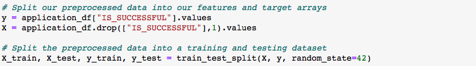
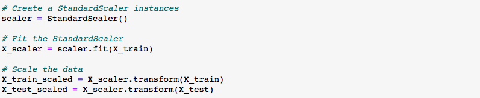
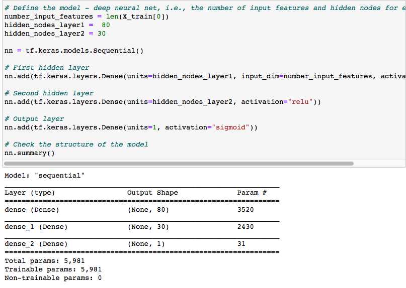
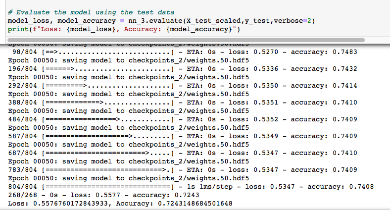

# Neural_Network_Analysis
## Overview
This project aims to help decide if applicants will be successful with their programs if funded by Alphabet Soup. As a member of the team in Alphabet Soup, the plan is to use neural network to perform analysis on the data collected over the years and to achieve 75% of accuracy on predictions.

Below are the detailed results from the analysis using neural network.

## Results
The results section includes the target and features used in the neural network model, then steps of initializing the model, split the data into training and testing sets, preprocess the data, train using the training data to the model, make predictions and transformations.

From the charity_data.csv file, a dataframe is created using pandas library to read the .csv file into a tabular format, within the dataframe created:

* column IS_SUCCESSFUL is the target for the model

* column EIN, and NAME are removed to decrease the noise in the model since they are irrelevant, therefore EIN and Name are neither targets nor features
* the rest of the columns for example APPLICATION_TYPE, AFFILIATION, USE_CASE, etc are features for the model

* the preprocessed data is split into training and testing sets, then scaled

* in the compiling, training, and evaluating phase: it's decided to have two layers, 80 neurons in the first layer, and 30 in the second layer in the model. Normally the neurons are decided to be 2-3 times the features, and we have 43 features passed into the model, therefore we used 80 neurons in the first layer. And the reason to not use as many neurons in the second layer or third (if applicable) is to avoid having the model overfitting. Activation function "relu" is used for both layers, and "sigmoid" is used for the output layer activation function. 

* target model performance is to achieve 75% of accuracy, however our model has only around 72.8% accuracy with 56.2% of data loss. 

* to improve the model performance, the following optimization methods are used:
    
    1. noisy variable removed from features: during preprocessing data, one more column - "CLASSIFICATION" is dropped.
    2. an additional hidden layer is added
    3. reducing the number of epochs to the training regimen

## Summary
After trying the above ways to optimize the model, the accuracy did not increase to 75%. Other ways to consider are to reduce the dropped columns, for example, leave the NAME column as is and categorize them into four bins based on the counts of their occurrence, and then train the model with more features in it, and see if the prediction has increased accuracy.

For recommendations, random forest model can be an option to try out. Because random forest classifiers will combine multiple smaller models and build on them to form a more robust and accurate model.